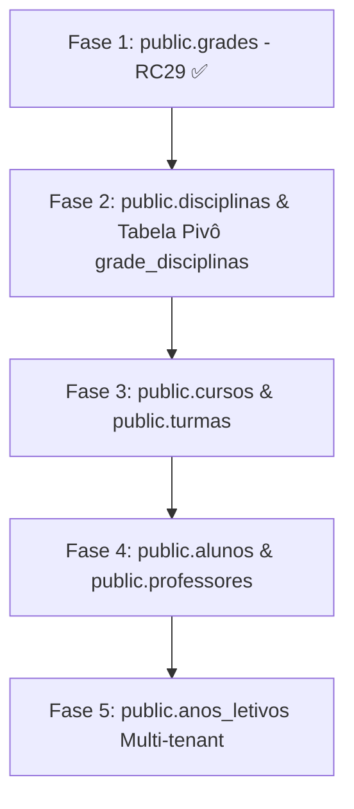

# 🗺️ PLANO OFICIAL DE MODERNIZAÇÃO DO SCHEMA ACADÊMICO — CREESER ERP

> **Documento de Referência Arquitetural**  
> **Versão:** 1.0  
> **Última Atualização:** 30/07/2026  

---

## 1. 📊 Status Atual das Tabelas Acadêmicas

### 🟢 Modernizadas / Em Padrão Atual
- **`public.grades` (Fase 1 - RC29):** Estrutura modernizada com suporte dual a `curso_id`, `instituicao_id`, `situacao`, `created_at`, `updated_at` mantendo colunas legadas em modo retrocompatível.
- **`public.planejamento_diario`:** Tabela moderna com PK `UUID`, `snake_case` e suporte a multi-tenancy.
- **`public.diario_frequencia`:** Tabela moderna com PK `UUID` e relacionamento por `snake_case`.
- **`public.notas_faltas`:** Tabela moderna com PK `UUID`, `snake_case` e suporte a multi-tenancy.

### 🟡 Parcialmente Legadas (Requerem Padronização)
- **`public.cursos`:** PK `INTEGER`, colunas em texto contínuo sem sublinhado (`cargahoraria`, `datacriacao`). Possui `instituicao_id`.
- **`public.turmas`:** PK `INTEGER`, colunas `unidadeid`, `cursoid`, `gradeid`, `datacriacao`. Possui `instituicao_id`.
- **`public.alunos` (Matrículas):** Contém 86 colunas unificando dados pessoais e acadêmicos. PK `INTEGER`, colunas `cursoid`, `turmaid`, `datacriacao`. Possui `instituicao_id`.
- **`public.professores`:** PK `INTEGER`, colunas `usuarioid`, `statusvinculo`, `datacriacao`. Possui `instituicao_id`.
- **`public.anos_letivos`:** PK `INTEGER`, colunas `datainicio`, `datafim`, `datacriacao`. Faltam `instituicao_id` e `created_at`.
- **`public.disciplinas`:** PK `UUID` recente, porém vincula `grade` e `curso` por string textual em vez de Foreign Keys explícitas.

---

## 2. 🚦 Ordem Recomendada das Próximas Migrações



1. **Fase 2 (Próxima): `disciplinas` e Tabela Pivô `grade_disciplinas`**
   - Substituir a vinculação textual pelo relacionamento relacional N:N estruturado (`grade_disciplinas`).
2. **Fase 3: `cursos` e `turmas`**
   - Migração não destrutiva para colunas `snake_case` (`carga_horaria`, `created_at`, `updated_at`, `curso_id`, `grade_id`).
3. **Fase 4: `alunos` (Matrículas) e `professores`**
   - Normalização dos relacionamentos `usuario_id`, `curso_id`, `turma_id`, `created_at`, `updated_at`.
4. **Fase 5: `anos_letivos` (Calendário Acadêmico)**
   - Adição de `instituicao_id` para suporte completo a multi-tenancy e timestamps modernos.

---

## 3. ⚠️ Riscos Conhecidos e Estratégias de Mitigação

| Risco Conhecido | Causa | Estratégia de Mitigação |
| :--- | :--- | :--- |
| **Incompatibilidade de Tipo nas Foreign Keys** | Mistura de PKs `INTEGER` (tabelas legadas) com `UUID` (tabelas novas). | Manter colunas de ligação aceitando inteiros durante a fase de transição (ex: `curso_id INTEGER REFERENCES cursos(id)`). |
| **Break de Frontend por Nomes de Atributos** | Telas antigas que esperam `cursoid` ou `datacriacao` no JSON retornado pela API. | A API deve retornar objetos normalizados contendo tanto as chaves modernas (`curso_id`, `created_at`) quanto os aliases legados (`cursoid`, `datacriacao`). |
| **Falta de Tabela Pivô em Matrizes Curriculares** | `disciplinas` armazena o nome da matriz em texto simples. | Implementar fallback gracioso na API de disciplinas antes de aplicar a migration da tabela pivô. |

---

## 4. 🔗 Grafo de Dependências Entre Tabelas

```
instituicoes (UUID)
  ├── cursos (INTEGER / SERIAL)
  │     └── grades (INTEGER / SERIAL) ─── (RC29 Modernizada)
  │           └── disciplinas (UUID)
  └── turmas (INTEGER / SERIAL)
        ├── alunos (INTEGER / SERIAL)
        └── professores (INTEGER / SERIAL)
```
